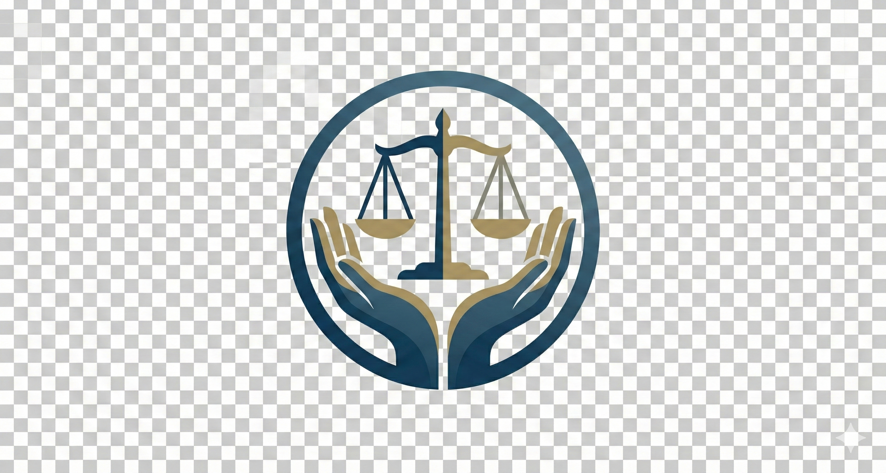

  

<h1 align="center">PartLawyer-Labor Arbitration Assistant</h1>

  <strong>劳动仲裁文书生成——辅助平台</strong>

  
  
  
  

  
  
  
  

---

## 📖 项目简介

**PartLawyer** 是一款专为劳动仲裁场景设计的辅助平台。作为**沈阳工程学院数据科学与大数据技术专业**的毕业设计，本项目利用 **DeepSeek-Qwen** 模型进行微调，并结合 3D 数字人交互技术，为用户提供沉浸式的法律咨询体验。

- **开发者**: 脑子不好真君 (Nǎozi bù hǎo zhēnjūn)
- **核心功能**: 劳动仲裁法律咨询、3D 数字人实时交互、角色配音合成。
